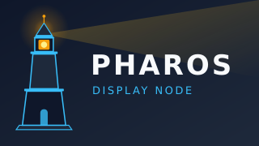

<p align="center">
  
</p>

<h1 align="center">Pharos</h1>

<p align="center">
  A general-purpose Android display and control node for dashboards, telemetry,
  alerts, media, automation, and AI-assisted interfaces.
</p>

<p align="center">
  <a href="LICENSE"></a>
  
  
</p>

---

## Why this exists

A spare Fire TV Stick, an old tablet, a phone with a cracked digitiser — each is
a screen, a network card and a CPU that already work. What they lack is
something to point at them.

Pharos is that something: install it, point it at a source, and the device
becomes an operations dashboard, a network status display, an alert endpoint, a
smart-home panel, a camera viewer, a digital sign, or a shared game screen.

The direction matters. **External systems integrate with Pharos, not the
reverse.** Pharos contains no knowledge of any particular backend — it speaks a
public, versioned, schema-validated JSON protocol over HTTP, WebSocket and MQTT,
and anything that can produce that JSON can drive it. It is not a scanner, a
monitoring backend, an automation server or an NVR; those stay where they are.

## Status

**Bootstrapping.** The architecture and roadmap are complete in
[`PLAN.md`](PLAN.md); the Android application is being built against it. There
is no installable release yet. `PLAN.md` §58 defines what MVP means and §59 the
phases getting there.

## Repository layout

```
PLAN.md          the master roadmap — architecture, protocol, phases, acceptance
brand/           logo, mark and TV banner; every icon is generated from these
docs/            user and developer documentation
scripts/         the ./dev CLI, preflight, the public-boundary scan
```

`app/`, `core/`, `schemas/` and `examples/` arrive with the code that fills
them — this repository does not carry empty directories to look finished.

## Quick start

```sh
git clone --recurse-submodules https://github.com/nikolareljin/pharos.git
cd pharos
./dev            # the verb list
./dev preflight  # everything CI runs, plus the checks CI cannot
```

Once the Android project lands:

```sh
./dev build android
./dev deploy --device <serial>   # install and launch on a connected device
./dev devices                    # what is connected
```

Sideloading onto a Fire TV Stick is documented in
[`docs/user/install.md`](docs/user/install.md).

## Design commitments

These are constraints, not aspirations — each is testable and each has a section
in `PLAN.md`.

| | |
|---|---|
| **Works offline** | Demo mode needs no server. A network outage never blanks the screen — the last valid content stays up with a quiet status hint |
| **Remote-first** | D-pad navigation is a release-quality requirement, not a port. Focus is always visible and always restorable |
| **No Google services** | Nothing in the app requires GMS, because the reference device does not have it |
| **Nothing arbitrary executes** | Commands come from a fixed allowlist. No shell, no eval, no downloaded code, no unrestricted JavaScript bridge |
| **Bounded everything** | Caches, queues, logs and alert storms all have ceilings. 2 GB of RAM is the design target, not the fallback |
| **Secrets stay out of sight** | Keystore-backed storage, redacted logs, and configuration that references secrets instead of containing them |

## Documentation

**[nikolareljin.github.io/pharos](https://nikolareljin.github.io/pharos/)** — the
full documentation site. The same pages are in `docs/` if you prefer them in the
repository.

- [docs/index.md](docs/index.md) — start here
- [docs/user/install.md](docs/user/install.md) — sideloading, Fire TV setup
- [docs/developer/architecture.md](docs/developer/architecture.md) — how the node is put together
- [docs/developer/protocol.md](docs/developer/protocol.md) — the public wire contract
- [docs/developer/integrations.md](docs/developer/integrations.md) — feeding Pharos from your own systems
- [docs/developer/development.md](docs/developer/development.md) — toolchain, `./dev`, preflight

## Contributing

Issues and pull requests are welcome — see [CONTRIBUTING.md](CONTRIBUTING.md).
Security reports go through
[a private advisory](https://github.com/nikolareljin/pharos/security/advisories/new),
never a public issue; see [SECURITY.md](SECURITY.md).

## License

MIT — see [LICENSE](LICENSE).
